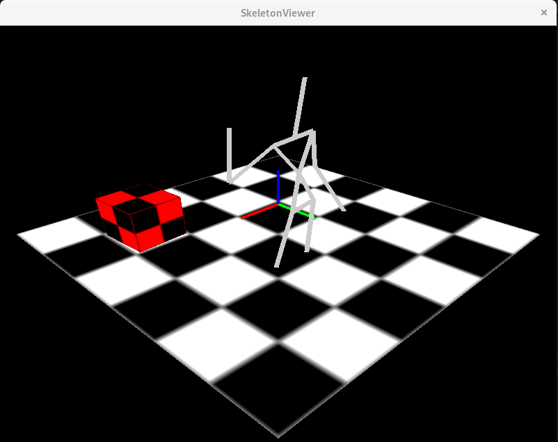

# KinectOpenNISetup

This repository contains a set of scripts and examples to help run and develop with the OpenNI library on Linux for the Kinect device development.
It contains a bash install script, an apptainer image file definition and two simple code examples written in C++.

## Install script

The install script must be run with root privileges.
It will download, compile and install the OpenNI library with a Kinect driver.
It explicitly specify commits hash to favor reproducibility.

Multiple dependencies are installed by the script, see `install_openni_kinect.sh`.
The freeglut3 library and openGL are installed only to allow running the samples.
libusb is however necessary to compile the OpenNI library and the Kinect driver.
Some dependancies such as python and java may be removed in the future as they are not amndatory for developing with openNI in C++.


## Apptainer image

The file `openni_kinect.def` is an [Apptainer](https://apptainer.org/) definition file which helps create an image with openNI installed inside.
The image is built using the bash installation script and apptainer must be installed to run it.

Note that a small modification was necessary in the Kinect driver to successfully run OpenNI in the container.
Moreover, on gnome+wayland systems (Debian for instance) it is necessary to allow users to connect to Xorg (Xwayland) for running graphical programs from the container.
This can be done with the following command: `xhost +SI:localuser:$(id -un)`. See more [here](https://unix.stackexchange.com/questions/330366/how-can-i-run-a-graphical-application-in-a-container-under-wayland).

The apptainer image can be built with:

`apptainer build openni_kinect.sif openni_kinct.def`

And a shell can be open in the image with the command:

`apptainer shell openni_kinect.sif`

## Samples

OpenNI provides several samples to test the device capabilities.
The samples are compiled automatically and can be tested from the directory `OpenNI/Platform/Linux/Redist/*/Samples/Bin`.

Two custom samples are also provided in this repository: SimpleSkeletonRevisited (non graphical) and SkeletonViewer (graphical).

### SimpleSkeletonRevisited

This sample is a modification of the original OpenNI sample that dumps skeleton data in the terminal. It is a minimal example of for data extraction from OpenNI API and does not require a graphical interface.

compile the example:

```
    $ cd SimpleSkeletonRevisited
    $ make SimpleSkeletonRevisited
```

and run:

```
    $ ./SimpleSkeletonRevisited
```   

### SkeletonViewer

SkeletonViewer is a small utility to visualize the skeleton data in 3d.
The 3d scene is created using OpenGL in displayed in a window with the [freeglut](https://freeglut.sourceforge.net/) library.
A skeleton, if available, is displayed at the center of the scene in a *wireframe* style.

compile the example:

```
    $ cd SkeletonViewer
    $ make SkeletonViewer
```

and run:

```
    $ ./SimpleSkeletonRevisited
``` 

